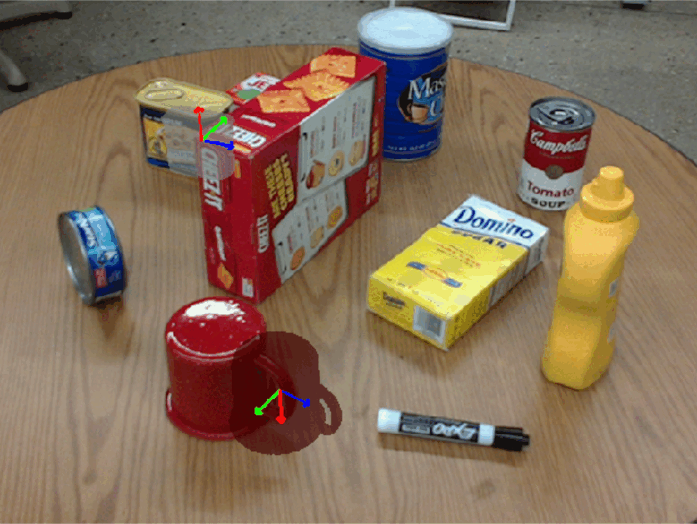
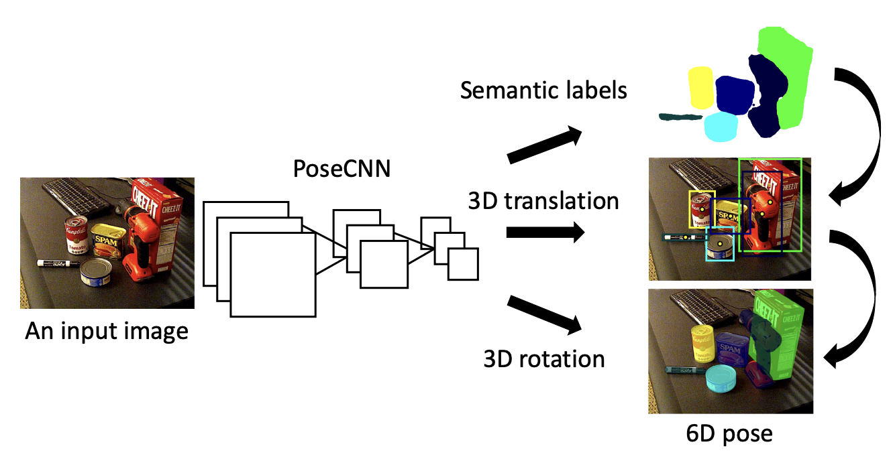
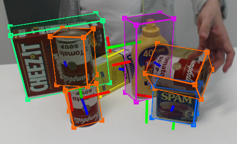
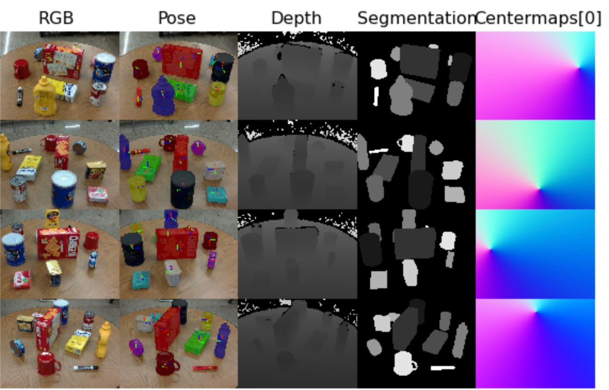
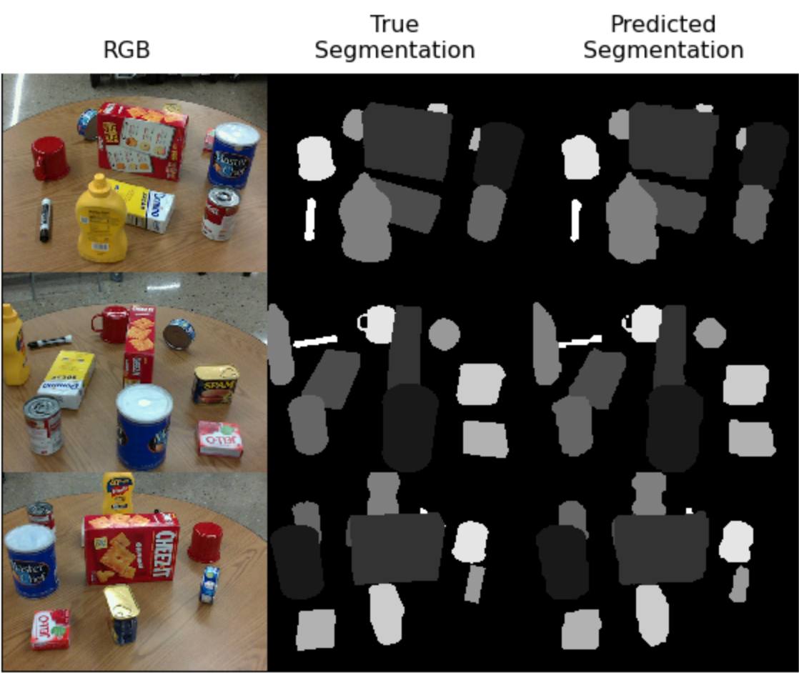
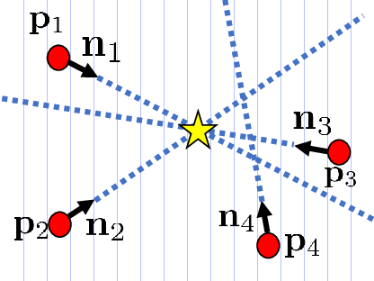

# End to End Object Pose Estimator
Implementation of an end-to-end object pose estimator, based on PoseCNN, which consists of two stages - feature extraction with a backbone network and pose estimation represented by instance segmentation, 3D translation estimation, and 3D rotation estimation.

  

[PoseCNN](https://arxiv.org/abs/1711.00199) :

  

# Contents

[***Objective***](https://github.com/leob03/E2E_Object_Pose_Estimator#objective)

[***Concepts***](https://github.com/leob03/E2E_Object_Pose_Estimator#concepts)

[***Overview***](https://github.com/leob03/E2E_Object_Pose_Estimator#overview)

[***Dependencies***](https://github.com/leob03/E2E_Object_Pose_Estimator#dependencies)

[***Getting started***](https://github.com/leob03/E2E_Object_Pose_Estimator#getting-started)

[***Deeper dive into the code***](https://github.com/leob03/E2E_Object_Pose_Estimator#deeper-dive-into-the-code)

# Objective

**To estimate the 3D translation of an object by localizing its center in the image and predicting its distance from the camera.**

In this project, we implemented an **end-to-end** object pose estimator, based on [PoseCNN](https://arxiv.org/abs/1711.00199), which consists of two stages - feature extraction with a backbone network and pose estimation represented by instance segmentation, 3D translation estimation, and 3D rotation estimation.
We will train it to estimate the pose of a set of object classes and evaluate the estimation accuracy.

  

# Concepts

* **Semantic Labeling**. In order to detect objects in images, we resort to semantic labeling, where the network classifies each image pixel into an
object class. Compared to recent 6D pose estimation methods that resort to object detection with bounding boxes, semantic labeling provides richer information about the objects and handles occlusions better.

* **3D Translation Estimation**. 3D translation estimation refers to the task of determining the spatial translation of an object in a three-dimensional coordinate system. It involves predicting the displacement or movement of an object from a reference position to its current position in 3D space. This dispacement can be represented by a translation vector that typically consists of three values representing the displacements along the x, y, and z axes.

* **3D Rotation Regression**. 3D rotation regression refers to the task of estimating the rotational orientation or pose of an object in three-dimensional space. It involves predicting the rotation parameters that describe the object's orientation relative to a reference position. The rotation parameters are typically represented as quaternions, Euler angles, or rotation matrices, which capture the object's orientation along the x, y, and z axes.
  
# Overview

This architecture is designed to take an RGB color image as input and produce a [6 degrees-of-freedom pose](https://en.wikipedia.org/wiki/Six_degrees_of_freedom) estimate for each instance of an object within the scene from which the image was taken. To do this, PoseCNN uses 5 operations within the architecture descried in the next pipeline:

- First, a backbone convolutional **feature extraction** network is used to produce a tensor representing learned features from the input image.
- Second, the extracted features are processed by an **embedding branch** to reduce the spatial resolution and memory overhead for downstream layers.
- Third, an **instance segmentation branch** uses the embedded features to identify regions in the image corresponding to each object instance (regions of interest).
- Fourth, the translations for each object instance are estimated using a **translation branch** along with the embedded features.
- Finally, a **rotation branch** uses the embedded features to estimate a rotation, in the form of a [quaternion](https://en.wikipedia.org/wiki/Quaternions_and_spatial_rotation), for each region of interest.

The architecture is shown in more detail from Figure 2 of the [PoseCNN paper](https://arxiv.org/abs/1711.00199):

Now, we will implement a variant of this architecture that performs each of the 5 operations using PyTorch and data from our `PROPSPoseDataset`.

# Dependencies
**Python 3.10**, modern version of **PyTorch**, **numpy** and **scipy** module. Most of these are okay to install with **pip**. To install all dependencies at once, run the command `pip install -r requirements.txt`

I only tested this code with Ubuntu 20.04, but I tried to make it as generic as possible (e.g. use of **os** module for file system interactions etc. So it might work on Windows and Mac relatively easily.)

# Getting started

1. **Get the code.** `$ git clone` the repo and install the Python dependencies
2. **Train the models.** Run the training `$ train.py` and wait. You'll see that the learning code writes checkpoints into `cv/` and periodically print its status. 
3. **Evaluate the models checkpoints and Visualize the predictions.** To evaluate a checkpoint run the scripts `$ python test.py` and pass it the path to a checkpoint (by modifying the checkpoint in the code, default: posecnn_model.pth).

# Deeper dive into the code

### PROPS Pose Dataset

In order to train and evaluate object pose estimation models, we need a dataset where each image is annotated with a *set* of *pose labels*, where each pose label gives the 3DoF position and 3DoF orientation of some object in the image.

We used the [PROPS Pose](https://deeprob.org/datasets/props-pose/) dataset, which provides annotations of this form. 
Our PROPS Detection dataset is much smaller than typical benchmarking pose estimation datasets, and thus easier to manage.
PROPS comprises annotated bounding boxes for 10 object classes:
`["master_chef_can", "cracker_box", "sugar_box", "tomato_soup_can", "mustard_bottle", "tuna_fish_can", "gelatin_box", "potted_meat_can", "mug", "large_marker"]`.
The choice of these objects is inspired by the [YCB object and Model set](https://ieeexplore.ieee.org/document/7251504) commonly used in robotic perception models.

We created a [`PyTorch Dataset`](https://pytorch.org/docs/stable/data.html#torch.utils.data.Dataset) class named `PROPSPoseDataset` in `utils/PROPSPoseDataset.py` that will download the PROPS Pose dataset. 

This dataset will format each sample from the dataset as a dictionary containing the following keys:

 - 'rgb': a numpy float32 array of shape (3, 480, 640) scaled to range [0,1]
 - 'depth': a numpy int32 array of shape (1, 480, 640) in (mm)
 - 'objs_id': a numpy uint8 array of shape (10,) containing integer ids for visible objects (1-10) and invisible objects (0)
 - 'label': a numpy bool array of shape (11, 480, 640) containing instance segmentation for objects in the scene
 - 'bbx': a numpy float64 array of shape (10, 4) containing (x, y, w, h) coordinates of object bounding boxes
 - 'RTs': a numpy float64 array of shape (10, 3, 4) containing homogeneous transformation matrices per object into camera coordinate frame
 - 'centermaps': a numpy float64 array of shape (30, 480, 640) containing (dx, dy, z) coordinates to each object's centroid 
 - 'centers': a numpy float64 array of shape (10, 2) containing (x, y) coordinates of object centroids projected to image plane 
 
This dataset assumes that the upper left of the image is the origin point (0, 0).

  

### Backbone and Feature Extraction Branch

In this project, we used [torchvision's](https://pytorch.org/vision/stable/index.html) pretrained convolutional networks for our backbone convolutional feature extractor. Specifically, we used the [VGG16 model](https://arxiv.org/abs/1409.1556) as our feature extractor.

### Segmentation Branch

This branch should fuse information from the feature extractor (`feature1` and `feature2`) according to the architecture diagram of PoseCNN. Specifically, the network passes both outputs from the feature extractor through a 1x1 convolution+ReLU layer followed by interpolation and an element wise addition. Next these intermediate features are interpolated back to the input image size followed by a final 1x1 convolution+ReLU layer to predict a probability for each class or background at each pixel.

  

### Translation Branch

Now that we have our feature extractor and instance segmentation implemented there is the translation branch, which follows a similar embedding structure as the instance segmentation.

### Rotation Branch

Now, the final module of PoseCNN: the rotation branch. This portion of PoseCNN will be reminiscient of fasterRCNN in that we will predict a quaternion for each possible class at each region of interest detected by our preceeding segmentation branch. To do this, we used ROIPooling for feature extraction.

### Hough Voting Layer

One important piece of the PoseCNN architecture for inference time is a Hough voting layer. As  illustrated below, a Hough voting layer is used during inference time to extract a single centroid prediction from the translation maps produced by `TranslationBranch` and the segments produced by `SegmentationBranch`.

  

